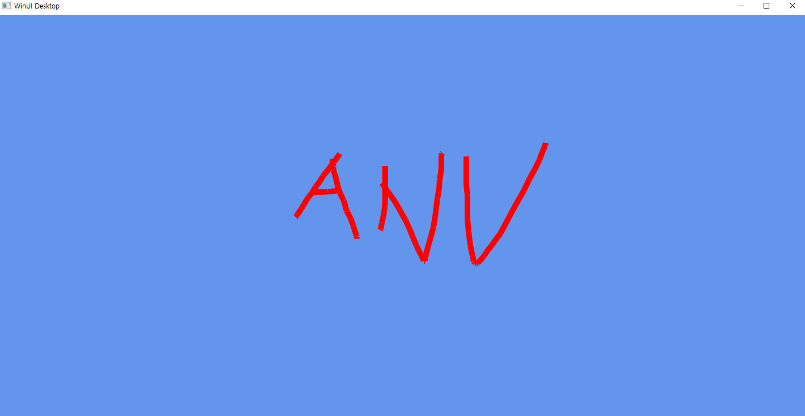

# 231120 비주얼프로그래밍 과제

20191276 컴퓨터공학과 양용석

MyPen 코드 

```
//MainWindow.xaml
<Window
    x:Class="MyPen.MainWindow"
    xmlns="http://schemas.microsoft.com/winfx/2006/xaml/presentation"
    xmlns:x="http://schemas.microsoft.com/winfx/2006/xaml"
    xmlns:local="using:MyPen"
    xmlns:d="http://schemas.microsoft.com/expression/blend/2008"
    xmlns:mc="http://schemas.openxmlformats.org/markup-compatibility/2006"
    xmlns:canvas="using:Microsoft.Graphics.Canvas.UI.Xaml"
    mc:Ignorable="d">

    <Grid>
        <canvas:CanvasControl Draw="CanvasControl_Draw"
                              PointerPressed="CanvasControl_PointerPressed"
                              PointerReleased="CanvasControl_PointerReleased"
                              PointerMoved="CanvasControl_PointerMoved"
                              ClearColor="CornflowerBlue"></canvas:CanvasControl>
    </Grid>
</Window>
```

```
//MainWindow.xaml.h
#include "MainWindow.g.h"
#include <winrt/Microsoft.Graphics.Canvas.UI.Xaml.h>
#include <winrt/Microsoft.UI.Input.h>
#include <winrt/Microsoft.UI.xaml.Input.h>

using namespace winrt::Microsoft::UI;
using namespace winrt::Microsoft::Graphics::Canvas::UI::Xaml;

namespace winrt::MyPen::implementation
{
    struct MainWindow : MainWindowT<MainWindow>
    {
        MainWindow()
        {
            // Xaml objects should not call InitializeComponent during construction.
            // See https://github.com/microsoft/cppwinrt/tree/master/nuget#initializecomponent
        }

        int32_t MyProperty();
        void MyProperty(int32_t value);

        bool flag;
        float px, py;
        std::vector<float> vx;
        std::vector<float> vy;
       
        void CanvasControl_Draw(winrt::Microsoft::Graphics::Canvas::UI::Xaml::CanvasControl const& sender, winrt::Microsoft::Graphics::Canvas::UI::Xaml::CanvasDrawEventArgs const& args);
        void CanvasControl_PointerPressed(winrt::Windows::Foundation::IInspectable const& sender, winrt::Microsoft::UI::Xaml::Input::PointerRoutedEventArgs const& e);
        void CanvasControl_PointerReleased(winrt::Windows::Foundation::IInspectable const& sender, winrt::Microsoft::UI::Xaml::Input::PointerRoutedEventArgs const& e);
        void CanvasControl_PointerMoved(winrt::Windows::Foundation::IInspectable const& sender, winrt::Microsoft::UI::Xaml::Input::PointerRoutedEventArgs const& e);
    };
}
```

```
//MainWindow.xaml.cpp
#include "pch.h"
#include "MainWindow.xaml.h"
#if __has_include("MainWindow.g.cpp")
#include "MainWindow.g.cpp"
#endif

using namespace winrt;
using namespace Microsoft::UI::Xaml;

// To learn more about WinUI, the WinUI project structure,
// and more about our project templates, see: http://aka.ms/winui-project-info.

namespace winrt::MyPen::implementation
{
   
    int32_t MainWindow::MyProperty()
    {
        throw hresult_not_implemented();
        flag = false;
        px = 100;
        py = 100;
    }

    void MainWindow::MyProperty(int32_t /* value */)
    {
        throw hresult_not_implemented();
    }

    
}

void winrt::MyPen::implementation::MainWindow::CanvasControl_Draw(winrt::Microsoft::Graphics::Canvas::UI::Xaml::CanvasControl const& sender, winrt::Microsoft::Graphics::Canvas::UI::Xaml::CanvasDrawEventArgs const& args)
{
    CanvasControl canvas = sender.as<CanvasControl>();
    int n = vx.size();
    for (int i = 1; i < n; i++) {
        if (vx[i] == 0 && vy[i] == 0) {
            i++; continue;
        }
        args.DrawingSession().DrawLine(vx[i - 1], vy[i - 1], vx[i], vy[i], Colors::Red(), 10);
    }
}


void winrt::MyPen::implementation::MainWindow::CanvasControl_PointerPressed(winrt::Windows::Foundation::IInspectable const& sender, winrt::Microsoft::UI::Xaml::Input::PointerRoutedEventArgs const& e)
{
    flag = true;
}


void winrt::MyPen::implementation::MainWindow::CanvasControl_PointerReleased(winrt::Windows::Foundation::IInspectable const& sender, winrt::Microsoft::UI::Xaml::Input::PointerRoutedEventArgs const& e)
{
    flag = false;
    px = py = 0.0;
    vx.push_back(px);
    vy.push_back(py);
}


void winrt::MyPen::implementation::MainWindow::CanvasControl_PointerMoved(winrt::Windows::Foundation::IInspectable const& sender, winrt::Microsoft::UI::Xaml::Input::PointerRoutedEventArgs const& e)
{
    CanvasControl canvas = sender.as<CanvasControl>();
    px = e.GetCurrentPoint(canvas).Position().X;
    py = e.GetCurrentPoint(canvas).Position().Y;
    if (flag) {
        vx.push_back(px);
        vy.push_back(py);
        canvas.Invalidate();
    }
}
```

실행 결과
</br>
